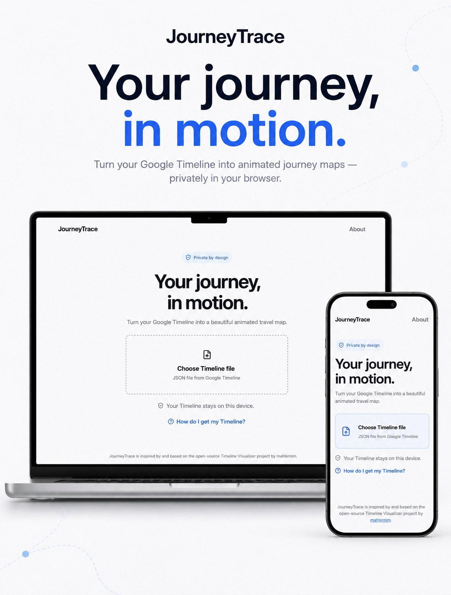

<p align="center">
  
</p>

<h1 align="center">JourneyTrace</h1>

<p align="center">
  Turn your Google Timeline into a private, animated journey map — directly in your browser.
</p>

<p align="center">
  <strong>Your data stays on your device.</strong> Map tiles are the only network dependency.
</p>

## What it does

- Imports Timeline JSON exported from Google Maps / device Timeline settings.
- Draws the complete route, animates movement, and offers fixed, steady, and dynamic cameras.
- Exports a shareable video locally, using browser-native video capabilities when available.
- Works on desktop and mobile layouts.

## See it in motion

<p align="center">
  
</p>

## Use it

1. **Get your Timeline data**
   - **Android:** `Settings → Location → Location services → Timeline → Export Timeline data`
   - **iPhone:** `Google Maps → profile picture → Settings → Personal content → Export Timeline data`
2. Open JourneyTrace and choose the exported JSON file.
3. Adjust the dates, camera, format, quality, and duration.
4. Preview the route or export a video.

> JourneyTrace supports current Timeline exports. The older Google Takeout `Location History` format is not supported.

For safe demo material, try the synthetic samples: [Toronto](public/samples/journeytrace-demo-toronto.json) or [Oslo](public/samples/journeytrace-demo-oslo.json).

## Built with

React, TypeScript, Vite, MapLibre GL, Web Workers, WebCodecs, and Mediabunny. Everything runs in the browser; there is no application backend or analytics service.

## Run locally

```bash
npm install
npm run dev -- --host 0.0.0.0
```

```bash
npm test
npm run build
```

## Credits

JourneyTrace is inspired by [Timeline Visualizer](https://github.com/mahlernim/google-timeline-visualizer) by [mahlernim](https://github.com/mahlernim). The original project is MIT licensed.
