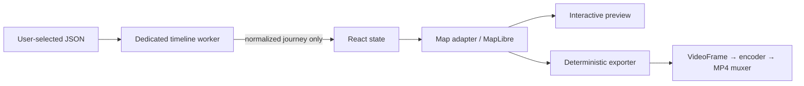

# Architecture

Raw files, coordinates, derived route, frames and video stay in browser memory/local download; no application API exists. Tiles are the only expected network traffic and URLs must never contain Timeline data. React owns UI/route selection, never geographic algorithms. `core/timeline`, `core/geo`, `core/journey`, and `core/animation` must be pure. The worker owns parse, validation, normalization, filtering, interpolation, timing and cancellation; map owns tile/style/GPU geometry.

Preview uses `requestAnimationFrame`. Export uses exact frame-index/FPS stepping, waits for render and tile readiness, lazy-loads encoding, probes `VideoEncoder.isConfigSupported`, applies queue backpressure, closes every frame, and muxes a Blob. Unsupported combinations provide a non-crashing fallback. Cancellation aborts worker/export work, closes encoder/frame resources and discards partial output. Mobile uses one worker, compact transferable geometry after profiling, capped preview DPR and no retained frame collection. Deployment is static HTTPS with immutable hashed assets, uncached HTML, SPA fallback and security headers.

## Implemented Timeline representation

`Journey` contains canonical `{lat,lng,timestamp}` points, a densified spherical `renderPath`, cumulative meters, deterministic statistics and an outlier count. It is readable object data rather than TypedArrays because no benchmark has yet demonstrated a transfer/memory benefit. The worker accepts `{type:'process', id, file, filter}` and `{type:'cancel', id}`, and emits progress, success, typed failure or cancelled messages. File decoding is inside the worker; consumers must terminate/replace workers on unmount or new requests.
